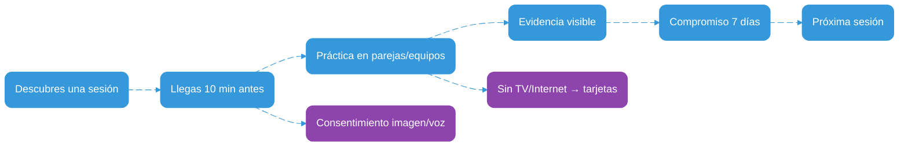
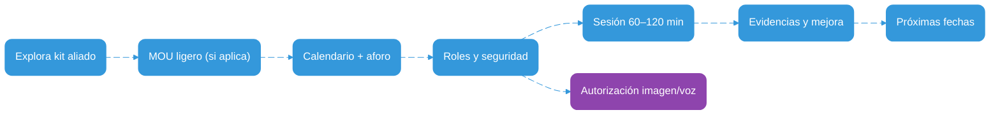

# Landing Copy — Circle Up Volunteer

Versión: 1.0 (borrador)
Vigencia: 2025-10-01

---

## Hero (encabezado principal)
- Título: Aprende y enseña donde estés. Construyamos tejido social.
- Subtítulo: Sesiones prácticas de 60–120 minutos con recursos mínimos. Voluntarios que comparten lo que saben; comunidades que crecen juntas.
- CTAs:
  - Quiero ser voluntario/a → Comenzar ahora
  - Tengo un espacio (biblioteca, café, centro) → Abrir mi puerta
  - Soy aliado/a (fundación, empresa, gobierno) → Conversemos
- Microcopy de confianza: Sin burocracia innecesaria. Enfoque humano, alta confianza y resultados observables.

### Hero: hooks multimedia sugeridos
- Video 30s (auto-mute, loop, subtitulado): “De la panadería a la biblioteca: aprender en cualquier lugar”.  
  Guion VO (11Labs, voz cálida): “No hay lugar equivocado para aprender. Círculos que convierten espacios cotidianos en aulas vivas. En 90 minutos, una historia, una analogía y una acción.”  
- Botón “Escuchar 20s”: clip de bienvenida con CTA a la primera sesión.  
- Fondo: gradiente vivo y escenas breves de sillas en círculo, tarjetas, pizarra.

---

## Navegación (Top nav)
- Participa  
- Facilita  
- Aliados  
- Cómo funciona  
- Historias  
- Seguridad  
- FAQ  
- Contacto  

CTA fijo (header): “Empezar ahora”  
CTA secundarios (según audiencia): Participar / Facilitar / Abrir mi espacio

---

## One-liner (propuesta de valor)
Un sistema de voluntariado de alta confianza y baja fricción que te da flujos listos para facilitar, materiales base y apoyo ligero para reengancharte cada mes.

---

## El problema que resolvemos
- Aprender y enseñar en espacios cotidianos es poderoso… pero pocas personas saben cómo empezar sin permisos complejos, materiales complicados o miedo escénico.
- Los espacios públicos (bibliotecas, cafés, salones, panaderías) están infrautilizados para aprendizaje.
- Quienes más podrían aportar a su comunidad (expertos, autodidactas, jóvenes) suelen quedarse al margen por falta de guías claras y apoyo.

---

## Nuestra solución
- Flujos pedagógicos listos para usar (TEACH.md) centrados en práctica, evidencia y transferencia.
- Operación simple (OPERATIONS.md): qué hacer antes, durante y después, sin cargas innecesarias.
- Métricas no punitivas: aprendemos para mejorar, no para sancionar.
- Ritmo sostenible: apuntamos a ~5 horas/mes por persona voluntaria.

### Highlights (módulo visual)
- Práctica ≥ 60%  
- Evidencias visibles  
- Alta confianza, baja fricción  
- Sesiones 60–120 min  
- Materiales base listos  
- Sin TV/Internet: tarjetas/pizarra

---

## Cómo funciona (3 pasos)
1) Elige un flujo (p. ej., Hook → Analogía → Acción) y descarga materiales base.  
2) Conecta con un espacio aliado o propón uno cercano (biblioteca, café, centro).  
3) Facilita 60–120 min: práctica ≥ 60%, evidencia visible, cierre con transferencia.  

Post-sesión: recoge retroalimentación amable, específica y útil; comparte evidencias sin datos sensibles; programa tu próximo encuentro.

---

## Para participantes
Aprende en 60–120 minutos con práctica real. No es cátedra: participas desde el minuto 10 y te llevas algo usable.

- Qué vivirás: práctica > 60%, ejemplos cotidianos, cuidado del tiempo y la voz de todos.  
- Qué te llevas: 1 micro-artefacto (guion/checklist/foto de pizarra) + 1 próximo paso en 7 días.  
- Pitch (participantes): “Hacemos más que hablamos. En 60–120 minutos, pruebas algo y te vas con un plan sencillo.”
- Docs relacionados: `guides/TEACH.md` (flujos), `policies/codigo-conducta.md`, `policies/autorizacion-imagen-menores.md`.

### Casos de uso (participantes)
- Hablar 60s con estructura 1–2–3 para presentar una idea.  
- Armar un mini-tablero y hacer 2 ciclos de enfoque de 12 min.  
- Diseñar feedback amable, específico y útil para tu equipo.

### Testimonios (participantes)
“Llegué por curiosidad y salí con un plan claro para la semana. No fue clase, fue práctica.” — Ana S.

---

## Para voluntarios/as
Facilita con materiales base y apoyo ligero. Dedica tu energía a la práctica y a la conversación, no a burocracia.

```mermaid
%%{init: {'theme':'base', 'themeVariables': {'primaryColor':'#3498db','primaryTextColor':'#ffffff','primaryBorderColor':'#3498db','lineColor':'#3498db','secondaryColor':'#3498db','tertiaryColor':'#3498db','background':'#ffffff','mainBkg':'#ffffff','secondBkg':'#ffffff','tertiaryBkg':'#ffffff'}}}%%
flowchart LR
    V1("Elige flujo (TEACH)")
    V2("Recibe materiales base")
    V3("Onboarding 30–45 min")
    V4("Prep ligera 15–30 min")
    V5("Facilita 60–120 min")
    V6("Evidencias + feedback amable")
    V7("Programa próxima sesión")
    VMENT("Buddy/mentoría opcional")

    V1 e1@--> V2
    V2 e2@--> V3
    V3 e3@--> V4
    V4 e4@--> V5
    V5 e5@--> V6
    V6 e6@--> V7
    V3 e7@-.-> VMENT

    classDef flowStyle fill:#3498db,stroke:#3498db,stroke-width:2px,color:#ffffff,rx:10,ry:10
    classDef noteStyle fill:#8e44ad,stroke:#8e44ad,stroke-width:2px,color:#ffffff,rx:10,ry:10
    class V1,V2,V3,V4,V5,V6,V7 flowStyle
    class VMENT noteStyle

    e1@{ animate: true }
    e2@{ animate: true }
    e3@{ animate: true }
    e4@{ animate: true }
    e5@{ animate: true }
    e6@{ animate: true }
    e7@{ animate: true }
```

- Qué vivirás: claridad en 1 página, práctica ≥ 60%, evidencia visible y transferencia.  
- Qué te llevas: guiones listos, checklists, micro-rúbrica, seguridad y ritmo sostenible (~5 h/mes).  
- Pitch (voluntariado): “Traes tu experiencia; nosotros ponemos el guion, el ritmo y el cuidado.”
- Docs relacionados: `guides/TEACH.md`, `OPERATIONS.md`, `guides/ejemplo-voluntario-experto.md`, `guides/ejemplo-voluntario-joven.md`, `guides/ejemplo-voluntario-sin-estudios.md`.

### Features (voluntariado)
- Guiones en segunda persona (entra y facilita).  
- Micro-rúbricas y checklists imprimibles.  
- Buddy/mentoría ligera bajo demanda.  
- Variante sin TV/Internet lista.

### Testimonios (voluntariado)
“Facilité sin ser docente. En 90 min, el grupo hizo y mostró resultados. Quiero repetir.” — Jorge R.

---

## Para aliados e interesados (espacios, fundaciones, empresas, gobiernos)
Abre tu puerta al aprendizaje con acuerdos ligeros y resultados observables. Conectamos saberes con tu espacio.

- Qué vivirás: coordinación simple, roles claros, métricas no punitivas, respeto a normativas locales.  
- Qué te llevas: sesiones de calidad con evidencias visibles y continuidad.  
- Pitch (aliados): “Tu espacio puede cambiar el barrio en 90 minutos. Nosotros cuidamos la metodología y la seguridad.”
- Docs relacionados: `OPERATIONS.md`, `policies/mou-espacios.md`, `policies/codigo-conducta.md`, `policies/autorizacion-imagen-menores.md`.

### Casos de uso (aliados)
- Biblioteca pública: miércoles 6 pm, ciclo de 4 semanas con evidencias fotográficas sin datos sensibles.  
- Café de barrio: sábados 10 am, charlas prácticas de 60–90 min.  
- Empresa/Universidad: voluntariado corporativo con flujos TEACH y evaluación no punitiva.

### Testimonios (aliados)
“Con 2 reuniones definimos calendario y roles. El impacto fue visible desde la primera sesión.” — Centro Comunitario La Estación

---

## Para quién es
- Personas expertas con años de experiencia que quieren elevar equipos con prácticas de calidad.
- Personas autodidactas con saberes prácticos valiosos que transforman vidas.
- Jóvenes con convicción y ganas de facilitar hábitos útiles en su comunidad.
- Espacios comunitarios (bibliotecas, cafés, centros barriales, escuelas) que quieren abrir su puerta al aprendizaje.

---

## Qué te llevas como voluntario/a
- Claridad: guiones en segunda persona listos para usar; checklists y micro-rúbricas de 1 página.
- Crecimiento: practicar oratoria y facilitación con feedback significativo.
- Impacto: ver a personas avanzar con evidencias visibles y próximos pasos concretos.
- Ritmo sostenible: sesiones cortas, alta práctica, materiales base sin crear desde cero.

---

## Resultados esperados (no punitivos)
- Satisfacción (NPS) objetivo ≥ 4.2/5.  
- Tiempo de Aprendizaje Efectivo (TAE) ≥ 60–70%.  
- Continuidad: % que repite o aplica en 7–14 días.  
- Bienestar del voluntario/a: ≤ 5 horas/mes para cuidar el ritmo.  

Medimos para aprender y mejorar.

---

## Filosofía que nos inspira
- Sistemas de alta confianza con responsabilidad compartida.  
- Retroalimentación amable, específica y útil (Ron Berger).  
- Repensar para mejorar (Think Again, Adam Grant).  

En la práctica: menos trámite, más aprendizaje visible; menos teoría, más hacer.

---

## Historias que nos mueven
- “Descubrí algo obvio: siempre puedo encontrar un espacio cotidiano para enseñar y aprender…”  
  Mira la historia completa y los guiones de 60s/30s en `landing/STORY-FOUNDERS.md`.

---

## Seguridad y confianza
- Código de conducta y respeto absoluto.  
- Imágenes de menores solo con autorización expresa y clara.  
- Privacidad por diseño: recopilamos solo lo mínimo para operar.  
- Referencias:
  - `policies/codigo-conducta.md`
  - `policies/autorizacion-imagen-menores.md`

---

## Preguntas frecuentes (FAQ)
- ¿Necesito ser docente?  
  No. Te damos flujos y guiones claros para facilitar práctica con evidencia.
- ¿Y si no hay TV o Internet?  
  Operamos con tarjetas o pizarra. Siempre hay versión sin pantalla.
- ¿Cuánto tiempo implica?  
  60–120 minutos por sesión. Buscamos ~5 horas/mes.
- ¿Puedo adaptar los materiales?  
  Sí, dentro de los criterios de calidad (práctica, evidencia, transferencia, cuidado).
- ¿Qué pasa con fotos y datos personales?  
  Ver `policies/autorizacion-imagen-menores.md` y notas de privacidad en `landing/COPYRIGHT-LEGAL.md`.
- ¿Puedo empezar solo/a?  
  Sí. Recomendamos co-facilitar cuando sea posible para cuidar tiempos y seguridad.

---

## Llamados a la acción
- Voluntariado: “Quiero facilitar mi primera sesión” → guía paso a paso + mentoría ligera.
- Espacios aliados: “Quiero abrir mi puerta al aprendizaje” → kit de bienvenida + MOU ligero.
- Aliados: “Quiero co-crear impacto” → conversación de 20 min + propuestas.

---

## Footer (microcopy)
- Contenidos pedagógicos diseñados con práctica ≥ 60% y evidencias visibles.  
- © 2025 Circle Up Volunteer. Ver `landing/COPYRIGHT-LEGAL.md`.
