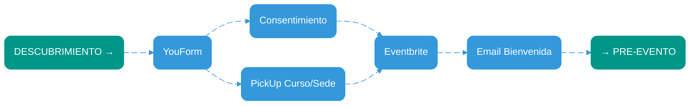

# OPERATIONS — CircleUp Volunteers

Manual operativo completo para ejecutar, medir y escalar el aprendizaje comunitario basado en voluntariado. Incluye flujos detallados, arquitectura de datos, protocolos de seguridad y estrategias de crecimiento.

---

## Principios de operación
- **Claridad**: cada paso tiene un responsable, un SLA y una métrica.
- **Medición continua**: instrumentación desde el primer contacto hasta el reenganche.
- **Seguridad por diseño**: protocolos de salvaguarda, consentimiento y manejo de datos.
- **Alianzas escalables**: MOUs estandarizados por tipo de espacio con términos claros.
- **Eficiencia de costos**: automatización donde sea posible, intervención humana donde agregue valor.

---

# Event Process Flow Diagrams
## Flujo Participantes (Journey Completo)

## 1. Discovery Flow

**Descubrimiento (Acquisition)**
- Instagram: 3-4 posts/semana + Stories diarias con stickers de acción. UTM por campaña.
- WhatsApp Broadcast: listas segmentadas por sede/tema. Máximo 2 mensajes/semana.
- Volanteo físico: QR codes únicos por sede para tracking.
- Referidos: programa de incentivos para aliados (reconocimiento público).
- SEO local: optimización para "cursos gratuitos [ciudad]" y "aprendizaje comunitario".


*_Multi-channel discovery approach with comprehensive tracking capabilities for lead generation optimization_*

## 2. Registration Flow

**Inscripción (Activation)**
- YouForm: formulario de 4 campos máximo (nombre, email, WhatsApp, consentimiento).
- Eventbrite/Lu.ma: integración automática con Calendly para recordatorios.
- Email bienvenida: plantilla con expectativas, ubicación, qué llevar.
- WhatsApp: adición automática a grupo de la sede (máximo 50 personas por grupo).



*_Streamlined registration process with automated confirmation and communication setup for enhanced user experience_*

## 3. Pre-Event Flow

**Pre-evento (Retention)**
- T-48h: email con agenda detallada y preparación.
- T-24h: WhatsApp con confirmación obligatoria ("Responde SÍ si asistes").
- T-3h: push notification o SMS de recordatorio final.
- Lista de espera: activación automática si confirmaciones < 70% del aforo.


*_Intelligent reminder system with automated waitlist management and dynamic capacity optimization_*

## 4. Event Day Flow

**Día del evento (Engagement)**
- Check-in: QR individual o lista física con firma.
- Cafés: validación de ticket mínimo (5,000-8,000 COP según MOU).
- Espacios públicos: registro simple, verificación de capacidad.
- Empresas/colegios: gafete o autorización previa del responsable local.
- Evidencias: 3-5 fotos por sesión, lista de asistencia firmada.


*_Flexible venue-based access control with comprehensive attendance tracking and evidence collection protocols_*

## 5. Post-Event Flow

**Post-evento (Advocacy)**
- NPS: encuesta de 3 preguntas máximo enviada inmediatamente al finalizar.
- Certificado: generación automática con Weasyprint si NPS ≥ 4.0.
- Materiales: email con slides, recursos adicionales y próximos cursos.
- Remarketing: segmentación automática (promotores, neutros, detractores).


*_Quality-driven feedback collection with automated certification delivery and intelligent remarketing segmentation_*

## Overall Process Flow


*_End-to-end event lifecycle management with continuous improvement feedback loop for sustained engagement_*

### KPIs y SLAs del flujo
- **Conversión**: UTM→Registro ≥ 15%; Registro→Asistencia ≥ 75%.
- **Calidad**: NPS ≥ 4.2; satisfacción ≥ 4.3; quejas ≤ 2%.
- **Operación**: ocupación ≥ 70%; no-show ≤ 10%; tiempo check-in ≤ 5 min/persona.
- **Crecimiento**: reenganche ≥ 35%; referidos ≥ 20%; crecimiento orgánico ≥ 10%/mes.

---

## Flujo Voluntarios (Lifecycle Management)

# Volunteer Lifecycle Management Flow Diagrams

## 1. Recruitment Flow

**Reclutamiento (Talent Acquisition)**
- Instagram: campañas segmentadas por perfil profesional y geográfico.
- Referidos: programa de incentivos (reconocimiento + acceso temprano a nuevas herramientas).
- Universidades: partnerships con carreras afines (educación, comunicación, ingeniería).
- Screening: entrevista de 15 min + verificación de antecedentes básicos.


*_Multi-channel volunteer acquisition strategy with intelligent screening and qualification pipeline management_*

## 2. Onboarding Flow

**Onboarding (Capability Building)**
- Módulo 1: misión, valores, teoría de cambio (45 min).
- Módulo 2: código de conducta, políticas de marca (30 min).
- Módulo 3: protección de menores, salvaguarda, manejo de crisis (60 min).
- Módulo 4: herramientas digitales, accesos, primeros pasos (45 min).
- Evaluación: quiz de 20 preguntas + caso práctico.


*_Comprehensive educational program with ethics training and competency validation for volunteer readiness_*

## 3. Development & Tools Access Flow

**Desarrollo (Tool Mastery)**
- Auth0: acceso único a todas las herramientas.
- Canva: plantillas personalizadas por tipo de curso.
- Google Slides + Cloud: 100 GB de almacenamiento por voluntario.
- Weasyprint: generación automática de certificados y handouts.
- YouForm API: creación de formularios personalizados.
- Jellypod: publicación directa a Spotify sin hosting.
- Deepgram: transcripción automática de sesiones.
- Calendly: integración con Eventbrite para gestión de horarios.


*_Technology stack provisioning with integrated digital toolkit for content creation and course management_*

## 4. Course Proposal Flow

**Propuesta de curso (Content Creation)**
- Formato estándar: título, descripción, objetivos, metodología, recursos, evaluación.
- Syllabus: estructura de 2-4 horas con bloques de 30-45 min.
- Objetivos SMART: específicos, medibles, alcanzables.
- Metodología: balance teoría/práctica 30/70.
- Recursos: máximo 3 herramientas/plataformas externas.


*_Structured course design framework with comprehensive pedagogical planning and assessment criteria_*

## 5. Review & Approval Flow

**Revisión y aprobación (Quality Assurance)**
- Asignación automática de revisor según expertise.
- Rúbrica de 10 criterios (claridad, relevancia, factibilidad, etc.).
- Feedback estructurado en máximo 48 horas.
- Máximo 2 rondas de ajustes antes de escalamiento.
- Aprobación final por coordinador académico.


*_Quality assurance process with peer review system and iterative improvement cycle for content excellence_*

## 6. Execution Flow

**Ejecución (Delivery Excellence)**
- Asignación de sede según disponibilidad y perfil del curso.
- Publicación automática en redes con plantillas predefinidas.
- Gestión de inscripciones con límites y listas de espera.
- Kit de materiales físicos (marcadores, papel, stickers).
- Protocolo de inicio: check-in, expectativas, reglas básicas.
- Captura obligatoria: 3-5 fotos, lista firmada, evidencias de aprendizaje.


*_End-to-end course delivery management with marketing automation and performance measurement integration_*

## 7. Post-Execution & Recognition Flow

**Post-ejecución (Impact Measurement)**
- Subida inmediata de materiales a repositorio compartido.
- Generación automática de podcast con Jellypod.
- Transcripción y etiquetado con Deepgram.
- Actualización de métricas en Snowflake.
- Feedback 1:1 con coordinador en máximo 7 días.
- Reconocimiento público en redes si NPS ≥ 4.5.
- Planificación de siguiente edición si demanda ≥ lista de espera.


*_Automated content processing with data analytics integration and volunteer recognition system for continuous engagement_*

## 8. Scholarships (Becas Educativas) Flow

**Reconocimiento (Semestral)**
- Selección semestral conforme a `policies/becas-educativas.md`.
- Uso personal e intransferible; cumplimiento de TOS del proveedor (p. ej., `policies/platzi.md`).


*_Flujo semestral de selección y activación de becas educativas, alineado con `policies/becas-educativas.md` y TOS de plataformas proveedoras_* 

## Overall Volunteer Lifecycle


*_Complete volunteer journey management with iterative improvement cycles and sustainable engagement framework_*

### KPIs y SLAs del flujo
- **Reclutamiento**: tiempo de screening ≤ 5 días; tasa de aprobación ≥ 60%.
- **Onboarding**: tiempo de completación ≤ 14 días; tasa de aprobación ≥ 85%.
- **Desarrollo**: tiempo de acceso a herramientas ≤ 24 horas; uso efectivo ≥ 80%.
- **Propuestas**: tiempo de revisión ≤ 48 horas; tasa de aprobación primera ronda ≥ 70%.
- **Ejecución**: UV ≥ 5 h/mes; NPS curso ≥ 4.2; puntualidad ≥ 95%.
- **Post-ejecución**: entrega de materiales ≤ 24 horas; feedback ≤ 7 días.

---

## Flujo Espacios y Aliados (Partnership Management)

## 1. Space Identification Flow


*_Strategic partner discovery and qualification process with systematic evaluation and lead nurturing pipeline_*

## 2. Negotiation & MOU Flow


*_Flexible partnership structure with customized legal agreements based on venue type and business model requirements_*

## 3. Setup & Configuration Flow


*_Comprehensive onboarding and operational readiness preparation with safety protocols and staff training integration_*

## 4. Operations & Event Management Flow


*_End-to-end event lifecycle management with collaborative marketing and comprehensive operational oversight_*

## 5. Evaluation & Partnership Review Flow


*_Data-driven partnership performance assessment with renewal decision framework and relationship lifecycle management_*

## 6. MOU Types & Requirements Reference

```mermaid
%%{init: {'theme':'base', 'themeVariables': {'primaryColor':'#3498db','primaryTextColor':'#ffffff','primaryBorderColor':'#3498db','lineColor':'#3498db','secondaryColor':'#3498db','tertiaryColor':'#3498db','background':'#ffffff','mainBkg':'#ffffff','secondBkg':'#ffffff','tertiaryBkg':'#ffffff'}}}%%
flowchart LR
    CENTER("MOU TIPOS")
    MOU1("Público/Biblioteca:<br/>Horarios, capacidad,<br/>responsable, seguridad,<br/>difusión básica")
    MOU2("Colegio:<br/>+ Salvaguarda menores,<br/>autorizaciones,<br/>contenidos apropiados")
    MOU3("Empresa:<br/>+ Patrocinio, branding,<br/>voluntariado corporativo,<br/>métricas")
    MOU4("Café:<br/>+ Ticket mínimo 3-4k COP,<br/>aforo, wifi, sonido,<br/>uso de imagen")
    
    CENTER e1@--> MOU1
    CENTER e2@--> MOU2
    CENTER e3@--> MOU3
    CENTER e4@--> MOU4

    classDef mouStyle fill:#3498db,stroke:#3498db,stroke-width:2px,color:#ffffff,rx:10,ry:10
    classDef nextStep fill:#009688,stroke:#009688,stroke-width:2px,color:#ffffff,rx:10,ry:10
    
    class MOU1,MOU2,MOU3,MOU4 mouStyle
    class CENTER nextStep
    
    e1@{ animate: true }
    e2@{ animate: true }
    e3@{ animate: true }
    e4@{ animate: true }
```

*_Comprehensive legal framework templates with venue-specific requirements and compliance standards_*

## Overall Partnership Management

```mermaid
%%{init: {'theme':'base', 'themeVariables': {'primaryColor':'#3498db','primaryTextColor':'#ffffff','primaryBorderColor':'#3498db','lineColor':'#3498db','secondaryColor':'#3498db','tertiaryColor':'#3498db','background':'#ffffff','mainBkg':'#ffffff','secondBkg':'#ffffff','tertiaryBkg':'#ffffff'}}}%%
flowchart LR
    A("IDENTIFICACIÓN")
    B("NEGOCIACIÓN")
    C("CONFIGURACIÓN")
    D("OPERACIÓN")
    E("EVALUACIÓN")
    
    A e1@--> B
    B e2@--> C
    C e3@--> D
    D e4@--> E
    E e5@--> D
    E e6@--> A
    
    classDef processStyle fill:#3498db,stroke:#3498db,stroke-width:2px,color:#ffffff,rx:10,ry:10

    class A,B,C,D,E processStyle
    
    e1@{ animate: true }
    e2@{ animate: true }
    e3@{ animate: true }
    e4@{ animate: true }
    e5@{ animate: true }
    e6@{ animate: true }
```

*_Strategic partnership lifecycle with continuous optimization and sustainable relationship management framework_*

Términos clave en MOU (según tipo)
- Público/Biblioteca/Colegio: horarios, capacidad, responsable local, seguridad, salvaguarda de menores, difusión básica (cartelera/boletín), cero cobro a participantes.
- Empresa: patrocinio (en especie o monetario), indicadores de alcance, uso de marca, voluntariado corporativo, ventanas de calendario.
- Café: ticket de consumo mínimo (el más bajo disponible y visible), aforo, señalización de consumo, wifi/sonido/enchufes, uso de imagen del local.

KPI del flujo
- Sedes activas ≥ 2; cumplimiento de agenda ≥ 90%; incidentes de seguridad = 0; satisfacción del aliado ≥ 4.3.

---

## Campañas de marca: Instagram (CircleUp Volunteers)

Objetivos
- Top of funnel: alcance y descubrimiento de cursos/sedes.
- Mid funnel: clics a inscripción y guardados.
- Bottom: asistencia efectiva y reenganche.

Pilares de contenido
- Historias de impacto (voluntarios/participantes).
- Agenda semanal por sede (carruseles + Stories con stickers de recordatorio).
- Behind the scenes: montaje de sede, preparación de cursos.
- Contenido útil (microtips de los cursos) + call to action.
- Audio-clips desde Spotify (Jellypod) con subtítulos (Deepgram) para Reels.

Cadencia sugerida
- 3–4 posts/semana + Stories diarias en semanas con cursos.
- Reels de 30–45s con CTA a inscripción.

Mecánicas
- UTM en enlaces de bio/Stories; Link-in-bio con categorías por sede.
- Colaboraciones con aliados (co-post) para ampliar alcance.
- WhatsApp Business: listas de difusión segmentadas por sede; recordatorios T-24/T-3.

Métricas de marketing
- Alcance, visualizaciones de perfil, CTR a inscripción, guardados/compartidos, crecimiento semanal de seguidores, % conversión registro→asistencia.

---

## Protocolos mínimos
- Protección de menores: regla de dos adultos, autorización y contenidos adecuados por franja etaria.
- Seguridad en sede: responsable local, botiquín, puntos de salida, registro de incidentes (si los hubiera).
- Marca y comunicación: uso consistente de identidad visual; respeto a lineamientos del aliado.

---

## SLA y reglas go/no-go operativas
- Si TAE < 70% por dos ciclos en una sede → revisión de franja horaria/tema y refuerzo de difusión.
- No-show de voluntarios > 15% en un mes → sobre-reclutamiento temporal + coaching de coordinación.
- Caída de NPS < 4.0 en una línea → pausa y rediseño de contenido + reforzar onboarding.

---

## Anexo: Kit digital del voluntario (resumen)
- Canva (plantillas) — 50 USD/año.
- Google Slides + Google Cloud (100 USD presupuesto operativo) — guías de diseño.
- Weasyprint (PDF) — certificados/handouts.
- YouForm API — formularios y consentimiento.
- Calendly Standard (120 USD/año) — agenda y recordatorios.
- WhatsApp Business + SIM dedicada — difusión/recordatorios.
- Auth0 — acceso.
- Deepgram (créditos) — transcripción.
- Jellypod (260 USD/año) — publicación en Spotify.
- Snowflake (créditos 800 USD/120 días; Basis 140 USD) — datos operativos.
- Dominio + GitHub Pages (20 USD) — presencia web ligera.

---

## Glosario de métricas
- TAE: tasa de asistencia efectiva (asistentes/inscritos).
- NPS: promotores – detractores (escala 0–10).
- UV: horas voluntario/mes.
- CPP/CPH: costo por participante / costo por hora.
- ARPU/CVP/MC/BE: ingreso promedio, costo variable, margen de contribución y punto de equilibrio.
