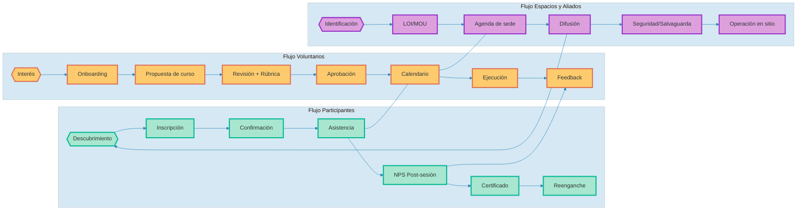

# CircleUp — Investor README (Ops + Business)

## The Spark: Make learning contagious
Jóvenes construyendo comunidad con conocimiento. Activamos espacios públicos, bibliotecas, colegios, empresas y cafés — fines de semana y entre semana — con voluntariado experto. Un diseño ligero, medible y escalable.

---

## TL;DR (why we win)
- Tracción operativa planificada: 680–800 participantes, 43–50 voluntarios; 1,360–1,600 horas-persona (sumatoria; p. ej., 800 personas × 2 h).
- Calidad como contrato social: TAE ≥ 75%, NPS ≥ 4.2; no-show voluntarios ≤ 10%.
- Eficiencia: CPP ≤ 20k COP, CPH ≤ 10.5k COP; MC positivo con ARPU institucional; break-even 233–581 participantes según escenario.
- Go-to-Market con aliados (B2G/B2B): LOIs/MOUs para sedes y difusión; patrocinios por sede/tema; programas in-company.

---

## Why now
- Los municipios buscan impacto costo-efectivo y rápido en juventud y comunidad.
- La adopción de herramientas low-code permite instrumentar datos/NPS y gobernanza desde el día 1.
- La generación joven exige experiencias útiles y medibles; el CBL (community-based learning) conecta oferta local con demanda real.

---

## North Star + Métricas que mueven la aguja
- North Star: horas de aprendizaje efectivas (horas-persona) con NPS ≥ 4.2.
- Tracción
  - LOIs firmadas ≥ 1; MOUs activos ≥ 2.
- Calidad
  - NPS ≥ 4.2/5; satisfacción ≥ 4.3/5.
  - TAE ≥ 75%; % no-show voluntarios ≤ 10%.
- Utilización
  - UV ≥ 5 h/mes; ocupación ≥ 70%.
- Eficiencia de costos
  - CPP ≤ 20,000 COP; CPH ≤ 10,500 COP; CAP ≈ 2,838; CTR ≈ 4,729; CAV ≈ 19,458.
- Economía de unidad
  - ARPU (30k/40k/60k); CVP (8k/6k/5k); MC (22k/34k/55k); BE ≈ 581/376/233.

> Fórmulas: MC = ARPU – CVP. BE = CF / MC. TAE = Asistentes efectivos / Inscritos.

---

## The community flywheel
- Más voluntarios → más temas/horarios → más participantes → más datos → mejor scheduling y QA → mayor NPS → mejor reputación → más aliados/patrocinios → atrae más voluntarios.
- Efecto red local: espacios públicos, bibliotecas, colegios, empresas y cafés + voluntariado profesional + reporting abierto.

---

## Operating model (personas, cursos y espacios)

Claves operativas
- Participantes: confirmaciones T-24/T-3; lista de espera y sobrecupos controlados; encuesta obligatoria.
- Voluntarios: onboarding en 4 sesiones; syllabus y rúbrica base; retroalimentación mensual.
- Espacios y aliados: LOI/MOU, agenda y responsable local; protocolos de seguridad y salvaguarda.

---

## Unit economics (field-tested)
- CF 6m ≈ 12,792,900 COP; CVP 4,338–5,838 COP.

| Escenario | ARPU | CVP | MC | BE (CF/MC) |
|---|---:|---:|---:|---:|
| Conservador | 30,000 | 8,000 | 22,000 | ≈ 581 |
| Base        | 40,000 | 6,000 | 34,000 | ≈ 376 |
| Ambicioso   | 60,000 | 5,000 | 55,000 | ≈ 233 |

Guardas
- CPP ≤ 20k; CPH ≤ 10.5k; si TAE < 70% dos ciclos → contingencia.
- No-show voluntarios ≤ 10%; si >15% → sobre-reclutamiento y re-calendario.

---

## Social lean: del propósito a la evidencia
- Tesis de impacto: jóvenes + espacios públicos + mentores locales = habilidades, agencia y tejido social.
- Métricas de impacto (proxy): NPS, TAE, ELH, retención por sede, tasa de recomendación; evidencias documentales (listas, encuestas, actas, certificados).
- Transparencia: reportería mensual con indicadores y evidencia operativa verificable.

---

## Business models (12-week experiments)
- B2G licencia/servicio municipal → LOI/Contrato, MC>0, cierre ≤ 12 semanas.
- Patrocinios por sede/tema → cubre ≥ 80% del ciclo; NPS ≥ 4.2.
- In-company / voluntariado corporativo → MC>0; satisfacción ≥ 4.3; caso de éxito.
- Micro-ticket en cafés (copago simbólico + becas) → TAE ≥ 75%; quejas ≤ 5%.

KPIs transversales: % LOI→contrato; tiempo a cierre; MC por contrato; BE alcanzado.

---

## OKRs (6m) + go/no-go
- O1 Operación eficiente y de calidad
  - KR: 680–800 part.; 1,360–1,600 horas-persona (sumatoria); TAE ≥ 75%; NPS ≥ 4.2; CPP ≤ 20k; CPH ≤ 10.5k.
- O2 Voluntariado y procesos
  - KR: 43–50 voluntarios; UV ≥ 5 h/mes; no-show ≤ 10%; 100% cursos con syllabus/rúbrica.
- O3 Sostenibilidad
  - KR: ≥ 1 LOI/contrato con MC>0; dashboard mensual y decisiones en comité.

Reglas
- Semana 4: MOUs firmados, stack mínimo activo, baseline definida.
- Semana 8: TAE ≥ 70%, UV ≥ 4 h/mes, NPS ≥ 4.0; si no, pausa/corrección.
- Mes 6: KR1–KR4 en verde y ≥ 1 LOI/contrato (MC>0) → escalar.

---

## Moat (práctico)
- Relaciones institucionales (sedes/difusión) + reputación local (NPS) + data de operación (cohortes por sede/tema).
- Cost advantage: estructura ultra-ligera con voluntariado, activos digitales y gobernanza mínima pero suficiente.

---

## Roadmap (6m)
- F1 Sem 1–4: DB+email, MOUs, oferta base, baseline y dashboard.
- F2 Sem 5–8: captar 43–50 voluntarios; capacitación; campañas.
- F3 Sem 9–26: operación + reportería mensual; decisiones PDCA.

---

## Definiciones rápidas
- ARPU: ingreso promedio por participante/contrato.
- CVP: costo variable por participante.
- MC: ARPU – CVP. BE: CF / MC.
- TAE: Asistentes efectivos / Inscritos. UV: horas voluntario/mes. NPS: promotores – detractores.
