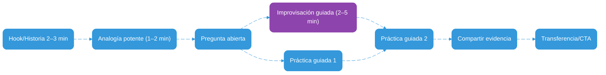
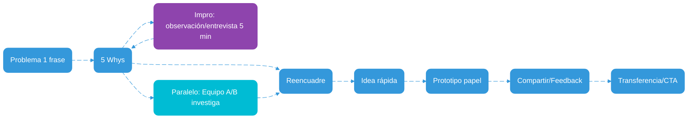

# TEACH — Flujos pragmáticos de facilitación (Circle Up Volunteers)

Versión: 1.0  
Vigencia: 2025-10-01

Este documento ofrece un “menú de flujos” para facilitar sesiones de alto impacto con recursos mínimos (sillas + TV/videobeam). Está alineado al core: práctica ≥ 60–70%, diseño 1–1–1 (1 objetivo, 1 práctica central, 1 evidencia) y cierre con transferencia. No es teoría de aprendizaje; es una caja de herramientas práctica inspirada en buenas charlas (p. ej., TED) y oratoria efectiva.[^r3][^hook]

---

## Cómo usar este documento
- Elige 1 flujo base según tu objetivo y audiencia.  
- Ajusta con 1–2 variantes (sin crear materiales desde cero).  
- Diseña la sesión en 1 página y dedica el tiempo a facilitar práctica y conversación.

---

## Principios rápidos (no negociables)
- Claridad de objetivo en 1 frase.  
- Práctica predominante (≈70/30).  
- Evidencia visible (artefacto, demo o lista de verificación).  
- Cierre con transferencia (siguiente paso concreto).  
- Tiempo y respeto: cronómetro, turnos breves, participación segura.

---

## Elige tu flujo en 10 segundos (Quick-start)
- Si necesitas enganchar y simplificar una idea compleja → usa HAA (Hook → Analogía → Acción).  
- Si quieres que la gente lo haga hoy mismo paso a paso → usa PPDP (Problema → Pregunta → Demo → Práctica).  
- Si buscas creatividad y mejora en vivo → usa Think Again Loop.  
- Si quieres participación amplia y co-creación segura → usa Co-creación por pares (TPS).  
- Si tu tema tiene 3 etapas claras → usa HMA (Historia → Mapa Visual → Acción).  
- Si el problema es difuso o hay múltiples causas → usa 5WRP (5 Whys → Reencuadre → Prototipo).

Consejo: elige 1 flujo y añade solo 1 variante. Evita mezclar más de 2 flujos en 2 horas.

---

# Biblioteca de flujos

## 1. Hook → Analogía → Acción (HAA)

- Notas de uso:  
  - Hook breve con tensión/curiosidad; la analogía aterriza el concepto a la vida real.  
  - Dos rondas de práctica incrementales; compartir evidencia para reforzar aprendizaje.  

- Guion paso a paso (ejemplo 1.5–2 h):  
  1) Hook/Historia (3 min): “La vez que perdí una oportunidad por explicar con jerga difícil.”  
  2) Analogía (2 min): “Tu explicación es como una escalera: si el primer peldaño está muy alto, nadie sube.”  
  3) Pregunta abierta (3 min): “¿Qué parte de tu explicación actual es un ‘peldaño demasiado alto’?”  
  4) Práctica 1 (25 min): reescribir 1 explicación usando la analogía.  
  5) Práctica 2 (25 min): probar con un compañero y ajustar.  
  6) Compartir evidencia (10 min): cada dupla muestra su frase/rediseño.  
  7) Transferencia (5 min): define 1 situación real donde usarás esta analogía en 7 días.

- Ejemplo concreto: “Enseñar APIs a principiantes” → Analogía: “Menús y cocinas de restaurante” (menú = endpoints; cocina = servidor; mesero = request).  

- Resultados esperados (observables):  
  - Cada persona produce 1 explicación con analogía + 1 checklist de claridad.  
  - ≥ 70% logra explicar su tema en ≤ 60 s con lenguaje simple.  

- Antipatrones comunes:  
  - Cátedra larga sin práctica; analogías forzadas o confusas; ejemplos sin relación con el público.  

- Variantes: sin TV, usa tarjetas impresas con analogías; para grupo grande, trabajar en mesas de 6–8.  

- Checklist del facilitador:  
  - [ ] Hook listo (≤ 3 min)  
  - [ ] Analogía testeada con 1 persona externa  
  - [ ] Cronómetro visible y turnos breves  

- Micro-rúbrica (auto-chequeo 4 ítems):  
  - Objetivo claro (sí/no)  
  - Práctica ≥ 60% (sí/no)  
  - Evidencia visible (sí/no)  
  - Transferencia definida (sí/no)

- Replantea (contrafactual): “Si solo tuvieras 45 minutos, ¿qué recortarías manteniendo el resultado?”

---

### Historia ejemplo (2–3 min) — "La escalera que nadie subía"
Tú: “Hace un año di una charla sobre ‘arquitectura de APIs’. Empecé con términos que a mí me parecían básicos: endpoints, payloads, autenticación. Noté miradas perdidas. Al final, alguien me dijo: ‘Entendí que es importante, pero no entendí qué es’.

Volví a casa y pensé en una imagen cotidiana. La siguiente vez dije: ‘Imaginen un restaurante. La carta es el catálogo de opciones: eso es un endpoint. Tú (cliente) haces un pedido: ese es el request. La cocina prepara tu plato: ahí vive la lógica del servidor. El mesero trae el resultado: ese es el response. Si pides algo que no está en la carta, el mesero te dirá: 404’.” (pausa 2–3 s, sonreír)

“En 30 segundos vi sonrisas y asentimientos. Una persona me dijo: ‘Ahora sí, me ubico’. La charla fue la misma, pero el primer peldaño de la ‘escalera’ ya no estaba tan alto. Desde entonces, antes de explicar un tema, busco una analogía simple que cualquiera pueda pisar. Hoy vamos a diseñar la tuya.”

Guion del facilitador (tú):  
- [Pausa breve] “Ahora piensa: ¿cuál es tu ‘peldaño alto’? Escribe una versión simple de tu idea, como si se la explicaras a un primo o vecina.”  
- “Intercambia con tu dupla, prueba la analogía y ajusta. Tienen 7 minutos. Yo marco el tiempo.”

---

## 2. Problema → Pregunta → Demo → Práctica (PPDP)

```mermaid
%%{init: {'theme':'base', 'themeVariables': {'primaryColor':'#3498db','primaryTextColor':'#ffffff','primaryBorderColor':'#3498db','lineColor':'#3498db','secondaryColor':'#3498db','tertiaryColor':'#3498db','background':'#ffffff','mainBkg':'#ffffff','secondBkg':'#ffffff','tertiaryBkg':'#ffffff'}}}%%
flowchart LR
    P1("Problema concreto")
    P2("Pregunta abierta")
    P3("Demo 3–5 min")
    P4("Práctica por parejas")
    P5("Práctica autónoma")
    P6("Puesta en común")
    P7("Transferencia/CTA")
    PIMP("Impro: demo alternativa sin TV")
    PPAR("Paralelismo en práctica")

    P1 e1@--> P2
    P2 e2@--> P3
    P3 e3@--> P4
    P2 e7@-.-> PIMP
    PIMP e8@--> P4
    P4 e4@--> P5
    P5 e5@--> P6
    P6 e6@--> P7
    P4 e9@-.-> PPAR
    PPAR e10@--> P5

    classDef flowStyle fill:#3498db,stroke:#3498db,stroke-width:2px,color:#ffffff,rx:10,ry:10
    classDef improvStyle fill:#8e44ad,stroke:#8e44ad,stroke-width:2px,color:#ffffff,rx:10,ry:10
    classDef parallelStyle fill:#00bcd4,stroke:#00bcd4,stroke-width:2px,color:#ffffff,rx:10,ry:10
    class P1,P2,P3,P4,P5,P6,P7 flowStyle
    class PIMP improvStyle
    class PPAR parallelStyle

    e1@{ animate: true }
    e2@{ animate: true }
    e3@{ animate: true }
    e4@{ animate: true }
    e5@{ animate: true }
    e6@{ animate: true }
    e7@{ animate: true }
    e8@{ animate: true }
    e9@{ animate: true }
    e10@{ animate: true }
```

- Notas de uso:  
  - Abre con un problema real; la demo es breve y “fría” (sin perfeccionismo).  
  - Alterna parejas → autonomía para consolidar.  

- Guion paso a paso (ejemplo 1.5–2 h):  
  1) Problema (3 min): “No logramos priorizar tareas del día.”  
  2) Pregunta (2 min): “¿Cómo deciden qué hacer primero?”  
  3) Demo (5 min): matriz impacto/esfuerzo en pizarra + ejemplo.  
  4) Parejas (20 min): cada dupla prioriza 6 tareas reales.  
  5) Autónomo (25 min): cada persona planifica su próxima hora.  
  6) Puesta en común (10 min): tips clave que funcionaron.  
  7) Transferencia (5 min): compromiso para mañana a las 9:00.

- Ejemplo concreto: “Priorizar backlog personal en 30 min” con matriz y temporizador.  

- Resultados esperados (observables):  
  - 1 mini-demo replicable + 1 checklist de priorización por persona.  
  - ≥ 80% sale con plan de 60 min para el día siguiente.

- Antipatrones:  
  - Demos largas sin manos a la obra; discusiones sin límite de tiempo; herramientas complejas.  

- Variantes: sin TV, usa papel/rotafolio; grupo grande → mesas con voceros.  

- Checklist del facilitador:  
  - [ ] Problema real en 1 frase  
  - [ ] Demo ≤ 5 min  
  - [ ] Preguntas abiertas preparadas  

- Micro-rúbrica (4 ítems): objetivo claro, práctica ≥ 60%, evidencia visible, transferencia concreta.  

- Replantea: “Si nadie trajo tareas reales, ¿qué casos neutrales usarás para practicar igual?”

---

### Historia ejemplo (2–3 min) — "El equipo que nunca empezaba"
Tú: “En un proyecto de comunidad, cada mañana abríamos el chat y todos decíamos: ‘estoy colapsado’. Teníamos 18 tareas, pero al final del día ninguna importante avanzaba. Parábamos a debatir qué herramienta usar. El lunes probamos una app; el martes, otra. La semana se fue sin resultados.

Un miércoles llegamos a la sede con una pizarra. Dibujé dos ejes: impacto y esfuerzo. ‘Pongan aquí sus 6 tareas reales’, dije. En 5 minutos teníamos un mapa claro. Hicimos una regla: ‘primero alto impacto/bajo esfuerzo; luego alto impacto/alto esfuerzo’. Cada quien marcó su próxima hora. A las 10:00 compartimos avances. Por primera vez, cerramos 5 tareas clave antes del almuerzo. La tecnología no era el problema; era la falta de una decisión simple y visible.”

Guion del facilitador (tú):  
- “Vamos a mapear 6 tareas reales en la matriz y a decidir tu próxima hora. No vamos a discutir herramientas; lo haremos con papel y marcador. Tienes 7 minutos para el mapeo y 3 para el plan.”

---

## 3. Think Again Loop (Reto → Experimento → Reflexión → Iteración)

```mermaid
%%{init: {'theme':'base', 'themeVariables': {'primaryColor':'#3498db','primaryTextColor':'#ffffff','primaryBorderColor':'#3498db','lineColor':'#3498db','secondaryColor':'#3498db','tertiaryColor':'#3498db','background':'#ffffff','mainBkg':'#ffffff','secondBkg':'#ffffff','tertiaryBkg':'#ffffff'}}}%%
flowchart LR
    T1("Reto a una suposición")
    T2("Experimento 1 (5–8 min)")
    TA("Equipo A: Variante A (90 s)")
    TB("Equipo B: Variante B (90 s)")
    T3("Reflexión breve")
    T4{"¿Mejora tangible?"}
    T5("Iteración/Experimento 2")
    T6("Compartir aprendizajes")
    T7("Transferencia/CTA")

    T1 e1@--> T2
    T2 e2a@--> TA
    T2 e2b@--> TB
    TA e2c@--> T3
    TB e2d@--> T3
    T3 e3@--> T4
    T4 e4@-->|Sí| T6
    T4 e5@-->|No| T5
    T5 e6@--> T6
    T6 e7@--> T7

    classDef flowStyle fill:#3498db,stroke:#3498db,stroke-width:2px,color:#ffffff,rx:10,ry:10
    classDef decisionStyle fill:#f39c12,stroke:#f39c12,stroke-width:3px,color:#ffffff,rx:10,ry:10
    classDef parallelStyle fill:#00bcd4,stroke:#00bcd4,stroke-width:2px,color:#ffffff,rx:10,ry:10

    class T1,T2,T3,T5,T6,T7,T4 flowStyle
    class TA,TB parallelStyle

    e1@{ animate: true }
    e2a@{ animate: true }
    e2b@{ animate: true }
    e2c@{ animate: true }
    e2d@{ animate: true }
    e3@{ animate: true }
    e4@{ animate: true }
    e5@{ animate: true }
    e6@{ animate: true }
    e7@{ animate: true }
```

- Notas de uso:  
  - Invita a “replantear” con experimentos cortos; no es debate teórico.  
  - La decisión se basa en mejora observable, no en opinión.  

- Guion paso a paso (ejemplo 1.5–2 h):  
  1) Reto (3 min): “¿Y si reducir el tiempo de explicación mejora la práctica?”  
  2) Experimento 1 (8 min): explicar un concepto en 90 s y medir comprensión.  
  3) Reflexión (5 min): qué funcionó/qué no.  
  4) Decisión: si mejoró, comparte; si no, iterar.  
  5) Experimento 2 (10 min): probar con analogía + pregunta abierta.  
  6) Compartir (10 min): aprendizajes por equipos.  
  7) Transferencia (5 min): define 1 cambio para tu próxima sesión.

- Ejemplo concreto: “Explicar variables en 90 s con una receta de cocina como analogía”.  

- Resultados esperados:  
  - 1 mejora concreta documentada por equipo.  
  - ≥ 70% reporta mayor claridad/ritmo.  

- Antipatrones:  
  - Debate de opiniones sin medición; iterar sin límite de tiempo; objetivos borrosos.  

- Checklist del facilitador:  
  - [ ] Métrica simple de resultado (p. ej., comprensión auto-reportada)  
  - [ ] Dos variantes preparadas (con/sin analogía)  

- Micro-rúbrica: objetivo claro, dos experimentos distintos, evidencia de mejora, plan siguiente.  

- Replantea: “¿Qué cambiarías si tu grupo fuera totalmente novato? ¿Y si fuera experto?”

---

### Historia ejemplo (2–3 min) — "El minuto que cambió la comprensión"
Tú: “Daba una sesión sobre ‘seguridad digital’. En la primera parte, expliqué durante 8 minutos y, aun así, las caras seguían en duda. Paré y propuse un experimento: ‘Voy a explicar con 90 segundos y una analogía de candados en una puerta’. Cronometré. Al terminar, pedí que marcaran con los dedos del 1 al 5 su claridad. Subió de 2 a 4 en la mayoría.

Iteramos: agregamos una pregunta abierta: ‘¿Qué puertas deberías cerrar hoy en tu teléfono?’ y pasamos a la práctica: activar el bloqueo biométrico y revisar permisos de 2 apps. Con 10 minutos más, la comprensión se convirtió en acción. El cambio fue el ritmo y la analogía, no más diapositivas.”

Guion del facilitador (tú):  
- “Divide al grupo en A/B: A usa analogía; B usa un diagrama. Midan claridad con dedos del 1 al 5. Si no mejora, iteramos con otra analogía. Cronometra y protege el tiempo de práctica.”

---

## 4. Co-creación por pares (Think–Pair–Share + Preguntas abiertas)

```mermaid
%%{init: {'theme':'base', 'themeVariables': {'primaryColor':'#3498db','primaryTextColor':'#ffffff','primaryBorderColor':'#3498db','lineColor':'#3498db','secondaryColor':'#3498db','tertiaryColor':'#3498db','background':'#ffffff','mainBkg':'#ffffff','secondBkg':'#ffffff','tertiaryBkg':'#ffffff'}}}%%
flowchart LR
    C1("Disparador/Historia 2–3 min")
    C2("Think: idea individual 2–3 min")
    C3("Pair: duplas 5–7 min")
    C4("Share: plenaria 8–10 min")
    C5("Práctica breve")
    C6("Evidencia visible")
    C7("Transferencia/CTA")
    CIMP("Impro: dinámica breve opcional")

    C1 e1@--> C2
    C2 e2@--> C3
    C3 e3@--> C4
    C3 e7@-.-> CIMP
    CIMP e8@--> C4
    C4 e4@--> C5
    C5 e5@--> C6
    C6 e6@--> C7

    classDef flowStyle fill:#3498db,stroke:#3498db,stroke-width:2px,color:#ffffff,rx:10,ry:10
    classDef improvStyle fill:#8e44ad,stroke:#8e44ad,stroke-width:2px,color:#ffffff,rx:10,ry:10
    class C1,C2,C3,C4,C5,C6,C7 flowStyle
    class CIMP improvStyle

    e1@{ animate: true }
    e2@{ animate: true }
    e3@{ animate: true }
    e4@{ animate: true }
    e5@{ animate: true }
    e6@{ animate: true }
    e7@{ animate: true }
    e8@{ animate: true }
```

- Notas de uso:  
  - Útil con grupos diversos; las duplas reducen ansiedad y elevan participación.  
  - El facilitador modera tiempos y hace 2–3 preguntas abiertas de alto impacto.  

- Guion paso a paso (ejemplo 1.5–2 h):  
  1) Disparador (3 min): historia breve o dato llamativo.  
  2) Think (3 min): idea individual en tarjeta.  
  3) Pair (7 min): duplas comparan, combinan y afinan.  
  4) Share (10 min): 3–5 aportes en plenaria.  
  5) Práctica breve (20–30 min): construir un micro-artefacto.  
  6) Evidencia (10 min): exhibición relámpago.  
  7) Transferencia (5 min): compromiso accionable.

- Ejemplo concreto: “Diseñar un guion 1–2–3 de 60 s para presentar tu proyecto.”  

- Resultados esperados:  
  - 1 micro-artefacto co-creado por persona/equipo.  
  - ≥ 70% participa en al menos 2 momentos.

- Antipatrones:  
  - Plenarias muy largas; grupos sin tiempo de práctica; falta de moderación.  

- Checklist del facilitador:  
  - [ ] Disparador listo (≤ 3 min)  
  - [ ] 2–3 preguntas abiertas de alto impacto  
  - [ ] Plan de mesas y tiempos

- Micro-rúbrica: objetivo claro, participación amplia, evidencia visible, transferencia.  

- Replantea: “Si no hay TV ni pizarra, ¿cómo operarías con solo tarjetas y cinta?”

---

### Historia ejemplo (2–3 min) — "La idea que apareció en la dupla"
Tú: “En una sesión de propuestas comunitarias, nadie quería hablar en plenaria. Cambié la dinámica: primero 2 minutos de ‘Think’ individual, luego duplas por afinidad. En 7 minutos, cada pareja tenía una idea combinada. Cuando invité a compartir, pedí solo 3 aportes de 60 segundos. El tercero salió de una dupla tímida: ‘Podemos hacer una ruta segura al colegio con 3 voluntarios y 2 paradas’. No nació en plenaria, nació en la pareja.”

Guion del facilitador (tú):  
- “Marca tiempos cortos. Pide a cada dupla que combine ideas en 3 bullets. En el ‘Share’, limita a 3 aportes y luego pasa a construir un micro-artefacto (mapa o cartel).”

---

## 5. Historia → Mapa Visual → Acción (HMA)

```mermaid
%%{init: {'theme':'base', 'themeVariables': {'primaryColor':'#3498db','primaryTextColor':'#ffffff','primaryBorderColor':'#3498db','lineColor':'#3498db','secondaryColor':'#3498db','tertiaryColor':'#3498db','background':'#ffffff','mainBkg':'#ffffff','secondBkg':'#ffffff','tertiaryBkg':'#ffffff'}}}%%
flowchart LR
    M1("Historia breve 2–3 min")
    M2("Mapa visual 1–2 min")
    M3("Pregunta de enfoque")
    M4("Práctica guiada")
    M5("Exhibición rápida")
    M6("Transferencia/CTA")
    MIMP("Impro: dibujo libre/plantilla")
    MPAR("Paralelo: individual vs pareja")

    M1 e1@--> M2
    M2 e2@--> M3
    M3 e3@--> M4
    M3 e7@-.-> MIMP
    MIMP e8@--> M4
    M4 e4@--> M5
    M4 e9@-.-> MPAR
    MPAR e10@--> M5
    M5 e5@--> M6

    classDef flowStyle fill:#3498db,stroke:#3498db,stroke-width:2px,color:#ffffff,rx:10,ry:10
    classDef improvStyle fill:#8e44ad,stroke:#8e44ad,stroke-width:2px,color:#ffffff,rx:10,ry:10
    classDef parallelStyle fill:#00bcd4,stroke:#00bcd4,stroke-width:2px,color:#ffffff,rx:10,ry:10
    class M1,M2,M3,M4,M5,M6 flowStyle
    class MIMP improvStyle
    class MPAR parallelStyle

    e1@{ animate: true }
    e2@{ animate: true }
    e3@{ animate: true }
    e4@{ animate: true }
    e5@{ animate: true }
    e7@{ animate: true }
    e8@{ animate: true }
    e9@{ animate: true }
    e10@{ animate: true }
```

- Notas de uso: mapa en pizarra o 1 slide con 3 etapas (A→B→C).  
- Ejemplo: “Cómo dar feedback: observar → describir → sugerir”.  
- Resultados: 1 mapa hecho por persona + 1 micro-acción definida.  
- Antipatrones: mapas recargados; demasiadas etapas; falta de práctica.

### Historia ejemplo (2–3 min) — "El mapa que ordenó la sala"
Tú: “Llegué a un taller con 30 personas y una pizarra. El tema: ‘Cómo dar feedback sin herir’. Todos tenían historias, opiniones, miedos. Era un torbellino. Les dije: ‘Vamos a dibujar un mapa juntos: A → B → C’.

En A escribimos ‘Observar’. En B: ‘Describir con hechos’. En C: ‘Sugerir siguiente paso’. Conté una historia: ‘Hace poco, en mi equipo, alguien llegó tarde 3 días. Mi impulso fue decir: “Eres irresponsable”. Paré, miré el mapa y dije: A) Vi que llegaste 3 días tarde 15–20 minutos; B) Esto afectó la apertura de la sala; C) Propongo que si prevés un retraso, avises con 30 minutos y que hoy nos repartamos la apertura’. La respuesta fue: “Gracias, me sirve”. La persona se ofreció a llegar antes los próximos dos días. El mapa nos dio un camino.”

Guion del facilitador (tú):  
- “Dibuja A→B→C en tu hoja. Escribe un caso real. Describe cada etapa con 1 frase simple. Si te atoras, usa la plantilla: ‘Vi → Impacto → Propongo’.”  
- “Ahora, decide si lo harás individual o en pareja. Tienen 8 minutos para el primer boceto y 4 para afinar.”

---

## 6. 5 Whys → Reencuadre → Prototipo (5WRP)

- Notas de uso: profundiza en la causa antes de proponer; prototipa en papel.  
- Ejemplo: “Baja asistencia” → ¿por qué? horarios, difusión, ubicación…  
- Resultados: 1 reencuadre + 1 boceto de solución; 2 ideas testables en 7 días.  
- Antipatrones: saltar a soluciones sin causa; whys interminables.

### Historia ejemplo (2–3 min) — "La causa que no era"
Tú: “Una sede nos dijo: ‘La gente no viene porque son perezosos’. Antes de aceptar esa hipótesis, hicimos 5 Whys con dos equipos. El A entrevistó a 3 personas que no asistieron. El B habló con la administración de la sede. En 10 minutos descubrimos que el aviso del evento llegaba la noche anterior y que la sede quedaba a 40 minutos sin transporte directo.

Reencuadramos: ‘No es pereza; es logística y anticipación’. El prototipo fue simple: publicar 5 días antes y ofrecer una sesión a las 7:30 am con un cupo limitado. La asistencia subió 30% en dos semanas. El cambio no fue de motivación, fue de calendario.”

Guion del facilitador (tú):  
- “Divide al grupo en A/B. A entrevista a 2–3 personas; B habla con la sede o revisa mensajes. Regresen con 1 hallazgo cada uno. En base a eso, reencuadren el problema en 1 frase y dibujen un prototipo en papel.”

---

# Pitches de ejemplo (guiones breves)

- Experto (feedback en equipos):  
  “Hoy vamos a convertir juicios en mejoras accionables. Les contaré un caso de 2 minutos, después practicaremos con sus ejemplos y saldrán con una guía de 1 página que podrán usar mañana.”

- Sin estudios formales (hablar en público):  
  “No necesitamos teoría; vamos a hablar por 45 segundos sobre un tema cotidiano, darnos feedback amable y repetir. Saldrás con un guion 1–2–3 para tu próxima charla.”

- Joven (productividad ligera):  
  “Vamos a crear un mini-tablero con 5 tareas reales y probaremos 2 ciclos de enfoque de 12 minutos. Lo importante no es la app, es el hábito.”

---

## Timeboxes sugeridos por duración de sesión
- 60 min: apertura 5’ → práctica 40’ → integración 10’ → cierre/CTA 5’.  
- 90 min: apertura 8’ → práctica 60’ (2 rondas) → integración 15’ → cierre/CTA 7’.  
- 120 min: apertura 10’ → práctica 80–90’ (2–3 rondas) → integración 15’ → cierre/CTA 5–10’.

Recomendación: protege siempre ≥ 60% del tiempo para práctica. Usa cronómetro visible.

---

## Troubleshooting (cuando algo no sale como esperabas)
- Grupo silencioso: empieza con Think (individual) y duplas; usa preguntas abiertas concretas.  
- Persona dominante: establece turnos cronometrados; usa “pasa la voz” a otra dupla.  
- Poco tiempo: ejecuta solo 1 ronda de práctica y deja la segunda como tarea con CTA claro.  
- Sin TV/Internet: opera con tarjetas/hojas y mapa en pizarra; evita depender de apps.  
- Baja energía: inserta una micro-activación de 60–90 s entre rondas.  
- Tema sensible: usa casos neutrales y anonimiza; no expongas datos personales.

---

## Voz y presencia (tips de oratoria práctica)
- Ritmo: 130–150 palabras/min; usa pausas de 2–3 s tras ideas clave.  
- Mirada: barrido en “W” por la audiencia, sin fijarte siempre en la misma persona.  
- Lenguaje: frases cortas, voz activa, regla de tres.[^r3]  
- Visuales: máximo 3 slides esenciales; alto contraste; nada de párrafos largos.  
- Hook: abre en ≤ 120 s con historia/pregunta/dato que importe.[^hook]

---

## Notas y recordatorios operativos
- Preparación: pide a coordinación materiales base; no crees desde cero.  
- Sin TV: usa tarjetas/hojas con prompts y cronómetro visible.  
- Evidencias: 3–5 fotos sin información sensible; lista de asistencia; NPS al cierre.  
- Cuidado del tiempo: modela la “regla de tres” y usa bloques cortos.

---

[^r3]: “Regla de tres”: estructura sencilla y memorizable (3 ideas/etapas) que mejora retención y ritmo en presentaciones.  
[^hook]: Un “hook” (gancho) es una historia, pregunta o dato que despierta curiosidad en los primeros 60–120 segundos.
