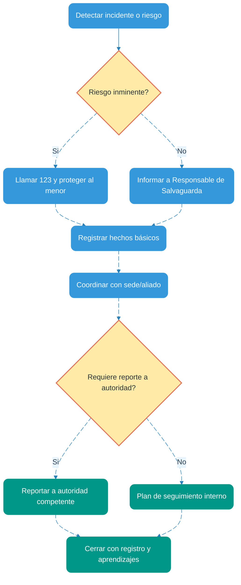

# Política de Protección de Menores — Circle Up Volunteers

Versión: 1.0  
Vigencia: 2025-10-01

Esta Política define los estándares mínimos de salvaguarda para la participación de personas menores de 18 años en actividades de Circle Up Volunteers ("Circle Up"). Se adapta a la naturaleza joven y de bajo riesgo del proyecto, priorizando claridad, proporcionalidad y prevención.

---

## 1) Alcance y definiciones
- Alcance: aplica a todas las actividades (cursos, talleres, charlas) en cualquier sede (espacios públicos, bibliotecas, colegios, empresas, cafés) y a comunicaciones asociadas (grupos y canales digitales).
- Menor de edad: persona menor de 18 años.
- Adulto responsable: voluntario/a o persona del aliado designada para supervisión.
- Incidente de salvaguarda: cualquier situación que afecte o pueda afectar la seguridad, bienestar o dignidad de un menor (p. ej., acoso, maltrato, negligencia, riesgo inminente).

---

## 2) Principios
- Interés superior del menor: toda decisión prioriza su seguridad y bienestar.
- Prevención: reducir riesgos con medidas simples, visibles y verificables.
- Proporcionalidad: recabar y usar el mínimo de datos necesarios.
- Confidencialidad: proteger la identidad e información de menores y denunciantes.
- Coordinación: respetar y aplicar protocolos de la sede aliada (colegios, bibliotecas, etc.).

---

## 3) Requisitos para participación de menores
- Autorización: consentimiento del representante legal y del menor (cuando sea apropiado).
- Información previa: objetivos, lugar, horarios, responsables y normas básicas.
- Registro: al ingreso, verificación de autorización y control de aforo.

---

## 4) Supervisión y regla de dos adultos
- Regla de dos adultos: nunca permanecer a solas un adulto con un menor; las reuniones deben ser visibles (puertas abiertas o espacios con visibilidad).
- Ratios orientativos: 1 adulto por cada 10 menores (13–17 años). Ajustar según actividad, espacio y riesgo.
- Traslados y sanitarios: acompañamiento visible; no permitir que un adulto acompañe a solas a un menor. Preferir acompañamiento entre pares, con supervisión a distancia.

---

## 5) Interacciones permitidas y prohibidas
- Permitido: lenguaje respetuoso, apoyo pedagógico, reconocimiento positivo.
- Prohibido: contacto físico no apropiado, mensajes privados 1:1, solicitudes de datos innecesarios, regalos personales, insinuaciones o conductas sexuales, compartir transporte privado a solas.
- Comunicación digital: usar canales oficiales grupales; si se requiere 1:1, incluir al representante o al canal oficial en copia.

---

## 6) Contenidos, imagen y medios
- Adecuación: contenidos y materiales deben ser pertinentes y apropiados a la edad.
- Imagen/fotografía: requerir consentimiento específico del representante legal; permitir exclusión de imagen sin represalia.
- Difusión: evitar identificar a menores con nombre completo o datos de localización; no etiquetar perfiles personales de menores.
- Audio/Podcast: solo con consentimiento; evitar datos identificables; curaduría previa.

---

## 7) Voluntariado: requisitos mínimos
- Compromisos: completar el módulo de salvaguarda, aceptar este documento y el Código de Conducta.
- Verificación básica: declaración de antecedentes y referencias simples cuando sea viable; en sedes escolares, seguir los requisitos del colegio.
- Roles: designar un Responsable de Salvaguarda por sede/evento (puede ser rotativo) para responder dudas, recibir reportes y activar el protocolo.

---

## 8) Protocolo de reporte y respuesta

Flujo resumido de gestión de incidentes:

Plazos orientativos
- Protección inmediata: acciones de seguridad de forma inmediata.
- Registro inicial: dentro de 24 horas (hechos, sin juicios de valor).
- Triage: dentro de 48 horas (evaluar gravedad, decidir escalamiento).
- Cierre y aprendizajes: dentro de 15 días hábiles o antes.

Canales de reporte
- Formulario oficial de incidentes (YouForm) o canal designado por sede.
- Se admite reporte anónimo; prohibidas represalias a quien reporta de buena fe.

---

## 9) Coordinación con sedes y aliados
- Respetar y aplicar las políticas del aliado (colegios, bibliotecas, empresas) cuando sean más estrictas.
- Dejar constancia en MOU de: responsables, horarios, aforos, espacios de visibilidad, y rutas de escalamiento.

---

## 10) Datos personales de menores
- Minimización: recabar solo lo necesario (p. ej., nombre, contacto del representante, autorizaciones).
- Acceso por roles: restringido al personal que lo requiere.
- Retención: conservar autorizaciones y registros de incidentes por el tiempo estrictamente necesario.

---

## 11) Incumplimientos y sanciones
- Cualquier incumplimiento puede derivar en la separación inmediata de la actividad y, según el caso, reporte a autoridades.
- Conductas graves (acoso, maltrato, riesgo sexual, violencia) implican expulsión y reporte inmediato.

---

## 12) Revisión y mejora
- Esta Política se revisará al menos cada 12 meses o antes si cambian las condiciones operativas o normativas.
- Se documentarán aprendizajes y mejoras tras cada incidente o simulacro.
